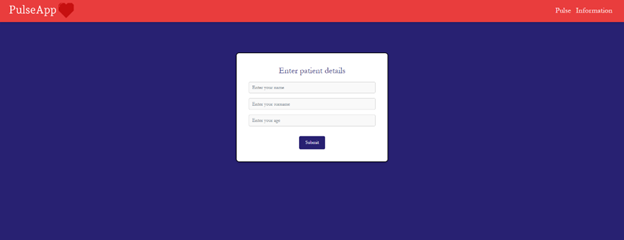
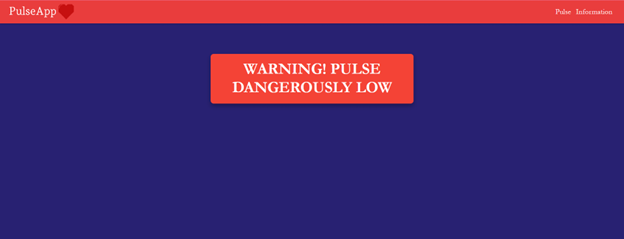
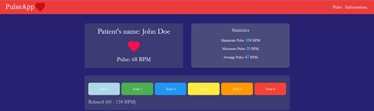
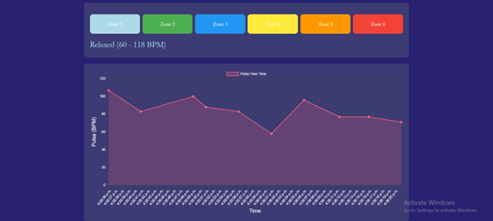
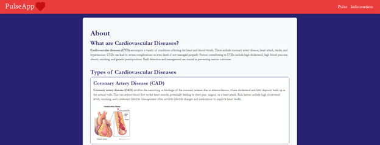

# PulseApp
PulseApp is a web application designed for monitoring patients with cardiovascular diseases. It allows healthcare providers to track patients' vital signs in real-time, providing crucial information to aid in timely medical decision-making.

## PulseApp offers a variety of features that support the efficient monitoring and management of patient health data:

### Real-time Heart Rate Monitoring:
Continuous tracking of heart rate data, collected via wearable sensors.
### Statistics:
View minimum, maximum, and average heart rates, with updates every 5 seconds.
### Heart Rate Zone Analysis: 
Displays which heart rate zone the patient is currently in, with zones like Resting, Light, Intensive, Aerobic, Anaerobic, and VO2 Max.
### Visual Data: 
Interactive charts and graphs showing heart rate trends over time and distribution across heart rate zones.
### Alerts: 
Automatic alerts if heart rate falls below or exceeds safe levels.
### Educational Content: 
Information page with resources on cardiovascular health, risk factors, symptoms, and prevention tips.
## Architecture
PulseApp consists of two main subsystems:

### IoT Subsystem
This subsystem uses a NodeMCU ESP8266 microcontroller connected to a MAX30102 heart rate sensor. It collects real-time data from the patient and sends it to the web server via Wi-Fi.

### Web Application Subsystem
The core of PulseApp is built on the ASP.NET Core framework with a C# backend. The frontend uses HTML, CSS, and JavaScript to provide a user-friendly interface. Data from the IoT subsystem is received by the web server and displayed to healthcare providers in real-time.
## Application interface
Here is a preview of the app's interface, showcasing the real-time heart rate monitoring and data visualization features. 

There is also a video showing how does the app work in the images folder. 
